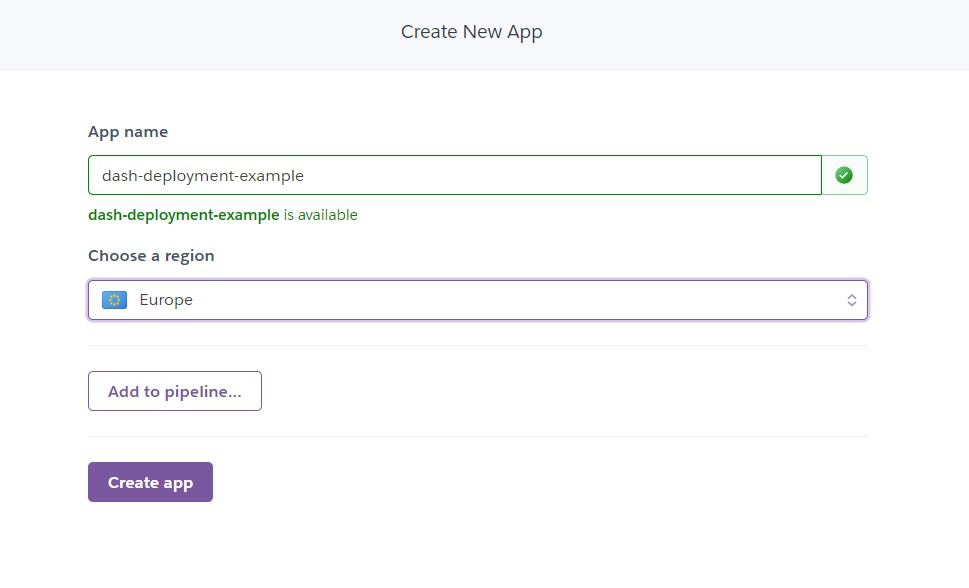
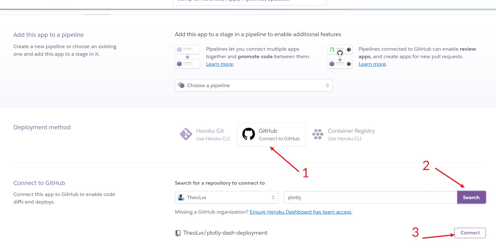
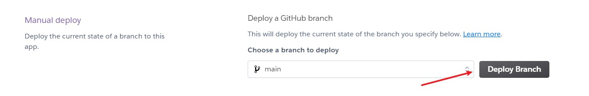
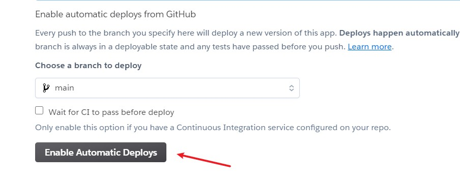
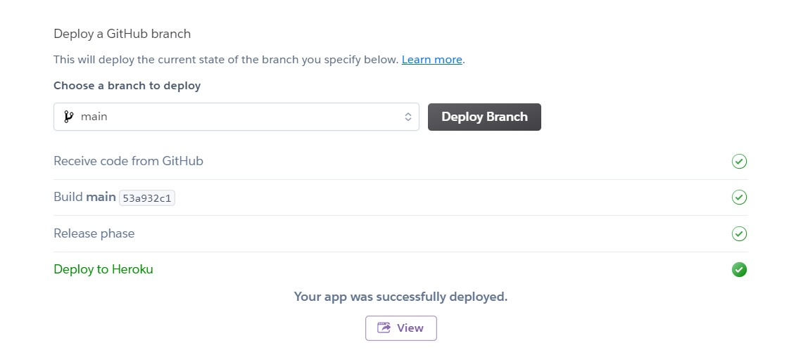
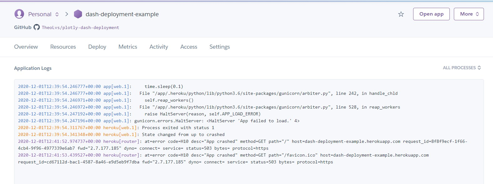

# plotly-dash-deployment

> A primer for plotly Dash deployments

## Creating a Dash application
Before deployment, the first step if of course to create your own application. <br>
You can follow the guidelines in Dash official documentation https://dash.plotly.com/installation

## Deploying your Dash application
https://dash.plotly.com/deployment
Dash/Plotly offers a paid service to super easily deploy and manager your applications. Yet as most of it is open source, and you may want a simple thing for a prototype, you can simply deploy it in your own server.

Then you have several options: 
- Beginners - Deploy it on a simple Heroku server
- Advanced - Deploy it on a cloud server (AWS, GCP, Azure) with docker containers

### Deploying on Heroku from GitHub
Heroku is the most simple server provider. It's even more simpleYou can create and deploy apps for free in just a few minutes. That's what we are going to do here : 

- Create your dash app, eg ``app.py``
- Create a requirements file, eg ``requirements.txt``. You can use tools such as ``pipreqs``, ``pipenv`` or other environment managers to help you create the right file. 
- Don't forget to add if not present the requirements to ``gunicorn`` in your requirements file
- Create a Procfile - it's a text file to help Heroku understand what file to be launched on the server. Write in it the following command. 
```
web: gunicorn app:server
```
- As of ``2020-12-01``, Dash documentation is not totally correct when it comes to deployment on Heroku, you should correctly link the server variable in Python and the declaration in the ``Procfile`` :
```python
# Add following line in your app.py script
server = app.server

# Write the Procfile
# - app refer to the file name app.py
# - server refer to the variable name for the Flask Server 
web: gunicorn app:server
```
- Deploy directly on Heroku from GitHub, you can follow the instructions below

  - Create a new application

  - Find the right name and server region

  - Link via github, search for your repo and click on connect

  - Deploy manually by clicking on deploy and choosing the right github branch


  - You can even set up a CI/CD process with auto-deploys by playing with the auto-deploy section


  - You are all set ! Your app should be live ! 

  


#### Problems you can encounter
- Having your app not at the root of the repo, you can use subdir buildpack
- Not linking correctly 

If your app does not work, you can check in the logs why it failed : 


#### What Heroku is doing under the hood
Heroku does a lot for us actually. It detects the technology behind the web server pushed on Heroku (Python, Node, etc...). Looks for a Procfile with instructions on how to launch the server. And knows many things on how to set it up. 

For example for Python servers, it will look first to find a ``requirements.txt`` file or ``pipenv.lock`` file. For a Node.js server it will look at the ``package.json`` and the lock file as well.  


### Deploying with Docker
If you want to better master what you are deploying. You may want to use Docker. It's actually universal and you'll be able to deploy it almost anywhere. 
https://github.com/jucyai/docker-dash/blob/master/Dockerfile

```docker
FROM python:3.9

ENV DASH_DEBUG_MODE True
COPY ./app /app
WORKDIR /app
RUN set -ex && \
    pip install -r requirements.txt
EXPOSE 8050
CMD ["python", "app.py"]
```


## Going further
To better deploy, it's always interesting to learn more about what you are manipulating. Here, you have to know that Dash is a wrapper for other technologies put together, and in particular:
- Flask as backend and server
- React as frontend
- Plotly (the python library) for most graphs

If you want to be a Deployment ninja 🐱‍👤, you may find useful to learn more about Flask and webservers in general. And eventually learn about React. 